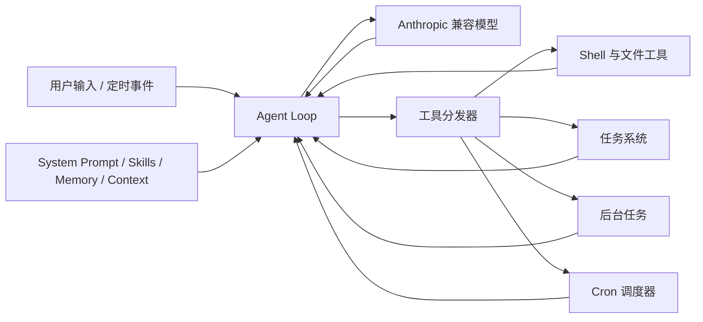

# mini-cc

mini-cc 是一个从零构建 AI 编程 Agent 的开源学习项目。项目参考 Claude Code 一类终端编程助手的工作方式，将 Agent Loop、工具调用、权限、子 Agent、上下文管理、记忆、任务系统、后台任务和定时调度拆成 20 个可以独立阅读与运行的章节。

> 本项目不是 Anthropic 官方 Claude Code，也不是生产级替代品。它的重点是用尽量直接的 Python 代码解释 Coding Agent 的核心机制。

## 当前进度

截至 2026-07-22，课程主线已完成 **s01-s14，共 14/20 章（70%）**。

- 已完成：s01 Agent Loop 至 s14 Cron Scheduler
- 当前最新章节：`s14_cron_scheduler`
- 规划中：s15 Agent Teams 至 s20 Comprehensive
- 当前代码已通过 Python 语法编译检查
- 在线模型调用需要在本地 `.env` 中配置有效 API Key

需要特别说明：每一章都是聚焦单个机制的教学快照。后续章节会继承主要结构，但可能主动省略上一章中较复杂的实现，以便突出本章主题。因此，`s14` 代表当前学习进度，不等于已经把 s01-s14 的全部高级实现完整合并为一个生产系统；最终整合会在 `s20` 完成。

## 已实现能力

| 章节 | 主题 | 核心内容 | 状态 |
| --- | --- | --- | --- |
| s01 | Agent Loop | 模型响应、工具结果回填、循环执行 | 已完成 |
| s02 | Tool Use | Shell 与文件读写等基础工具 | 已完成 |
| s03 | Permission | 工作区边界和危险操作拦截 | 已完成 |
| s04 | Hooks | 用户输入、工具调用和停止阶段的扩展点 | 已完成 |
| s05 | Todo Write | 待办规划、状态更新和遗漏提醒 | 已完成 |
| s06 | Subagent | 独立上下文的子任务委派与摘要返回 | 已完成 |
| s07 | Skill Loading | 技能目录扫描和按需加载 `SKILL.md` | 已完成 |
| s08 | Context Compact | 历史裁剪、工具结果预算、摘要压缩 | 已完成 |
| s09 | Memory | 跨会话记忆提取、索引、检索和整合 | 已完成 |
| s10 | System Prompt | 按运行状态组装提示词并缓存稳定结果 | 已完成 |
| s11 | Error Recovery | 超长上下文恢复、限流退避、模型降级和续写 | 已完成 |
| s12 | Task System | 持久化任务、依赖关系、领取和完成状态 | 已完成 |
| s13 | Background Tasks | 慢任务后台执行和完成通知注入 | 已完成 |
| s14 | Cron Scheduler | Cron 校验、持久化调度、触发队列和自动投递 | 已完成 |
| s15 | Agent Teams | 多 Agent 团队和角色分工 | 规划中 |
| s16 | Team Protocols | Agent 间消息与协作协议 | 规划中 |
| s17 | Autonomous Agents | 更长时间的自主执行与监督 | 规划中 |
| s18 | Worktree Isolation | Git Worktree 并行工作区隔离 | 规划中 |
| s19 | MCP Plugin | MCP 与插件扩展机制 | 规划中 |
| s20 | Comprehensive | 合并前述机制并形成完整 mini-cc | 规划中 |

## 当前架构



整体可以分成五层：

1. **模型交互层**：使用 Anthropic Python SDK 调用 Anthropic 或兼容服务。
2. **Agent 循环层**：维护 `messages`，识别 `tool_use`，执行工具并回填 `tool_result`。
3. **执行工具层**：提供 Shell、文件、任务、后台任务和定时调度工具。
4. **上下文层**：负责系统提示词、技能、压缩和长期记忆。
5. **编排层**：逐步加入子 Agent、任务依赖、异步执行和调度队列。

## 项目结构

```text
mini-cc/
├── README.md                  # 项目介绍、进度与运行说明
├── SUMMARY.md                 # 课程结构摘要
├── requirements.txt           # Python 依赖
├── skills/                    # 可按需加载的技能示例
├── s01_agent_loop/            # 每章包含 code.py 与 README.md
├── ...
├── s14_cron_scheduler/        # 当前最新完成章节
├── s15_agent_teams/           # 后续章节骨架
└── s20_comprehensive/         # 最终综合版本规划
```

运行时数据默认保存在 `.memory/`、`.tasks/`、`.transcripts/`、`.task_outputs/` 和 `.scheduled_tasks.json` 中，这些路径以及 `.env` 均已加入 `.gitignore`。

## 快速开始

### 1. 克隆并创建虚拟环境

```bash
git clone https://github.com/ChWjie/mini-cc.git
cd mini-cc

python3 -m venv .venv
source .venv/bin/activate
pip install -r requirements.txt
```

建议使用 Python 3.10 或更高版本。

### 2. 配置模型

在项目根目录创建 `.env`。使用 Anthropic 官方服务时：

```dotenv
ANTHROPIC_API_KEY=your-anthropic-api-key
MODEL_ID=your-model-id
```

也可以使用支持 Anthropic Messages 协议的兼容服务。例如阿里云百炼千问：

```dotenv
ANTHROPIC_API_KEY=your-dashscope-api-key
ANTHROPIC_BASE_URL=https://dashscope.aliyuncs.com/apps/anthropic
MODEL_ID=qwen3.7-plus
```

`s11_error_recovery` 还支持可选的备用模型：

```dotenv
FALLBACK_MODEL_ID=your-fallback-model-id
```

不要提交 `.env` 或在 Issue、日志、截图中公开 API Key。

### 3. 运行章节

每一章均可独立运行：

```bash
python s01_agent_loop/code.py
python s09_memory/code.py
python s14_cron_scheduler/code.py
```

运行当前最新版本：

```bash
python s14_cron_scheduler/code.py
```

可以尝试输入：

```text
创建两个存在依赖关系的开发任务，并列出当前任务状态。
```

或在 s14 中尝试：

```text
创建一个每 5 分钟执行一次的定时任务，内容是检查当前项目状态。
```

## s10-s14 本轮进展

### s10 System Prompt

- 将固定系统提示词拆为可组合的 `PROMPT_SECTIONS`
- 根据工作区、工具和记忆状态动态组装提示词
- 使用确定性的上下文序列化结果缓存提示词

### s11 Error Recovery

- 对 429 和 529 等临时错误执行指数退避与随机抖动
- 支持 `FALLBACK_MODEL_ID` 模型降级
- 对超长上下文执行一次紧急裁剪后重试
- 对输出截断执行 token 上限升级和有限次数续写

### s12 Task System

- 使用 `.tasks/*.json` 持久化任务
- 支持 `pending`、`in_progress`、`completed` 状态
- 支持 `blockedBy` 依赖检查、任务领取和下游解锁提示

### s13 Background Tasks

- 使用守护线程执行耗时工具调用
- 支持模型显式请求后台运行，也能根据命令特征判断慢任务
- 通过 `<task_notification>` 将完成结果重新注入 Agent 上下文

### s14 Cron Scheduler

- 支持标准五段 Cron 表达式的基础校验与匹配
- 支持周期任务、一次性任务、持久化任务和会话任务
- 提供 `schedule_cron`、`list_crons`、`cancel_cron` 工具
- 使用调度线程、触发队列和 Agent 锁自动投递到期任务

## 后续计划

1. **s15 Agent Teams**：建立多 Agent 团队、角色、共享任务和生命周期管理。
2. **s16 Team Protocols**：加入消息邮箱、广播、定向通信和协作状态协议。
3. **s17 Autonomous Agents**：实现自主领取任务、持续执行、停止条件和人工介入点。
4. **s18 Worktree Isolation**：为并行 Agent 创建隔离 Git Worktree，减少代码冲突。
5. **s19 MCP Plugin**：接入 MCP Server，并形成可发现、可配置的插件工具体系。
6. **s20 Comprehensive**：整合 s01-s19，补充自动化测试、统一配置、CLI 和完整文档。

## 使用边界

- `bash` 工具会执行真实 Shell 命令，请优先在测试仓库或隔离目录中运行。
- 当前权限系统属于教学实现，不能替代容器、操作系统权限或生产沙箱。
- Cron 与后台任务使用进程内线程；程序退出后，非持久化运行状态不会保留。
- 项目当前自动化测试仍不完整，真实模型调用还会受到兼容服务、模型能力和配额影响。

## 仓库

- GitHub: https://github.com/ChWjie/mini-cc
- 当前里程碑: `s14_cron_scheduler`
- 下一里程碑: `s15_agent_teams`
