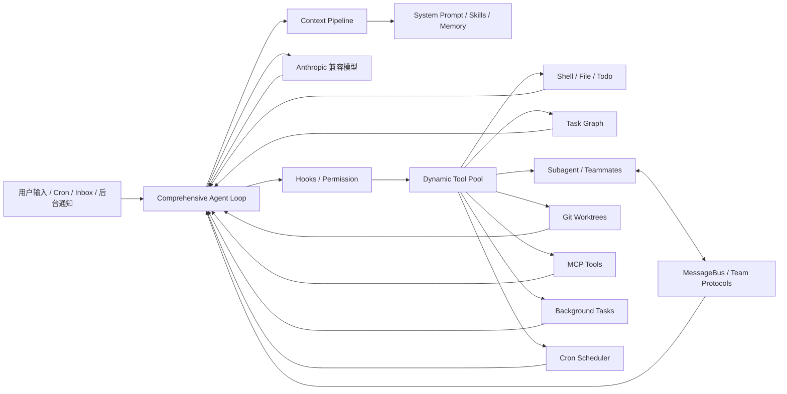

# mini-cc

mini-cc 是一个从零构建 AI 编程 Agent 的开源学习项目。项目参考 Claude Code 一类终端编程助手的工作方式，用 20 个递进章节解释 Agent Loop、工具调用、权限、子 Agent、上下文管理、长期记忆、任务编排、多 Agent 协作、Git Worktree 和 MCP 工具扩展。

> 本项目不是 Anthropic 官方 Claude Code，也不是生产级替代品。它的目标是用可以独立阅读和运行的 Python 代码，展示 Coding Agent 的核心架构与演进过程。

## 当前进度

截至 2026-07-22，课程主线 **s01-s20 已全部完成，共 20/20 章（100%）**。

- 递进课程：s01 Agent Loop 至 s19 MCP Plugin
- 最终整合：`s20_comprehensive`
- 代码规模：20 个独立章节，每章包含 `code.py` 与说明文档
- 验证状态：全部章节通过 Python 语法编译检查
- 离线验证：s16-s20 的协议、任务、Worktree、MCP 和综合组件冒烟测试通过
- 在线运行：需要在本地 `.env` 中配置有效 API Key

每一章都是聚焦一个机制的教学快照。部分中间章节会暂时省略上一章的复杂实现，以突出当前主题；`s20_comprehensive` 再把核心能力组合进同一个 Agent Loop。s20 是完整课程成果，但仍属于教学实现，不应直接作为生产沙箱使用。

## 最终效果

完成 s01-s20 后，项目已经形成一个可以在终端运行的迷你 Coding Agent，具备以下能力：

- 调用大模型并持续执行 `tool_use -> tool_result` 循环
- 使用 Shell、文件读写、编辑和 Glob 等开发工具
- 通过路径边界、权限 Hook 和危险命令规则控制工具执行
- 使用 Todo、持久化任务和依赖图规划复杂工作
- 派生轻量 Subagent，并创建带独立上下文的 Teammate Agent
- 通过文件消息总线和请求响应协议协调多个 Agent
- 让空闲 Teammate 自动发现、领取并完成可执行任务
- 按需加载技能、压缩上下文、注入记忆索引并恢复模型错误
- 把慢工具放到后台执行，并将结果重新注入对话
- 注册和触发 Cron 定时任务
- 为并行任务创建隔离的 Git Worktree
- 动态连接教学版 MCP Server 并合并外部工具

## 课程地图

| 章节 | 主题 | 核心内容 | 状态 |
| --- | --- | --- | --- |
| s01 | Agent Loop | 模型响应、工具结果回填、循环执行 | 已完成 |
| s02 | Tool Use | Shell 与文件工具 | 已完成 |
| s03 | Permission | 工作区边界和危险操作拦截 | 已完成 |
| s04 | Hooks | 输入、工具和停止阶段扩展点 | 已完成 |
| s05 | Todo Write | 待办规划、状态更新和遗漏提醒 | 已完成 |
| s06 | Subagent | 独立上下文的子任务委派 | 已完成 |
| s07 | Skill Loading | 扫描并按需加载 `SKILL.md` | 已完成 |
| s08 | Context Compact | 历史裁剪、结果预算和摘要压缩 | 已完成 |
| s09 | Memory | 记忆提取、索引、检索和整合 | 已完成 |
| s10 | System Prompt | 按运行状态动态组装提示词 | 已完成 |
| s11 | Error Recovery | 限流退避、模型降级、压缩和续写 | 已完成 |
| s12 | Task System | 持久化任务、依赖、领取和完成 | 已完成 |
| s13 | Background Tasks | 慢任务后台执行与结果通知 | 已完成 |
| s14 | Cron Scheduler | Cron 校验、持久化和自动投递 | 已完成 |
| s15 | Agent Teams | MessageBus、Lead 与 Teammate | 已完成 |
| s16 | Team Protocols | `request_id`、计划审批和优雅关闭 | 已完成 |
| s17 | Autonomous Agents | 自动领任务和 WORK/IDLE 生命周期 | 已完成 |
| s18 | Worktree Isolation | 隔离分支、任务绑定和安全清理 | 已完成 |
| s19 | MCP Plugin | 工具发现、命名空间和动态工具池 | 已完成 |
| s20 | Comprehensive | 将课程核心机制整合到统一循环 | 已完成 |

## s20 架构



### 关键数据流

1. 用户输入、定时事件、团队消息和后台结果进入统一会话。
2. 上下文流水线压缩旧消息、控制工具结果预算，并读取技能与记忆状态。
3. 模型返回文本或工具调用。
4. PreToolUse Hook 先执行权限判断，通过后才进入动态工具分发器。
5. 同步工具立即返回结果，慢工具进入后台线程，Cron 和 Inbox 在后续轮次注入。
6. 结果作为用户侧内容回填，Agent Loop 继续运行，直到模型不再调用工具。

## 项目结构

```text
mini-cc/
├── README.md                    # 项目介绍、架构、进度与运行说明
├── SUMMARY.md                   # 课程摘要
├── requirements.txt             # Python 依赖
├── skills/                      # 可按需加载的技能示例
├── s01_agent_loop/
├── s02_tool_use/
├── ...
├── s19_mcp_plugin/
└── s20_comprehensive/           # 最终综合版本
    ├── code.py
    └── README.md
```

每个 `sXX_*` 目录包含：

- `code.py`：该阶段可以独立运行的实现。
- `README.md`：问题、目标、数据流、代码变化和验收方式。

运行时状态保存在 `.memory/`、`.tasks/`、`.mailboxes/`、`.worktrees/`、`.transcripts/`、`.task_outputs/` 和 `.scheduled_tasks.json` 中。这些路径以及 `.env` 已加入 `.gitignore`。

## 快速开始

### 1. 克隆与安装

```bash
git clone https://github.com/ChWjie/mini-cc.git
cd mini-cc

python3 -m venv .venv
source .venv/bin/activate
pip install -r requirements.txt
```

建议使用 Python 3.10 或更高版本。

### 2. 配置模型

在项目根目录创建 `.env`。使用 Anthropic 官方或其他 Anthropic Messages 兼容服务均可。

```dotenv
ANTHROPIC_API_KEY=your-api-key
MODEL_ID=your-model-id
```

使用阿里云百炼千问时，可以配置为：

```dotenv
ANTHROPIC_API_KEY=your-dashscope-api-key
ANTHROPIC_BASE_URL=https://dashscope.aliyuncs.com/apps/anthropic
MODEL_ID=qwen3.7-plus
```

错误恢复章节和综合版本还支持可选备用模型：

```dotenv
FALLBACK_MODEL_ID=your-fallback-model-id
```

不要提交 `.env`，也不要在 Issue、日志或截图中公开 API Key。

### 3. 按章节运行

```bash
python s01_agent_loop/code.py
python s09_memory/code.py
python s15_agent_teams/code.py
python s19_mcp_plugin/code.py
```

### 4. 运行最终综合版本

```bash
python s20_comprehensive/code.py
```

可以尝试：

```text
分析当前项目，为“补充测试”和“完善文档”创建带依赖关系的任务，
为两个任务创建隔离 worktree，并派遣两个 teammate 协作完成。
```

也可以体验动态 MCP 工具：

```text
连接 docs MCP server，查看新发现的工具，然后搜索 coding agent 文档。
```

## s15-s20 多 Agent 主线

### s15 Agent Teams

- 文件型 `.mailboxes/*.jsonl` 消息总线
- Lead 创建后台 Teammate 线程
- 独立上下文、受限工具和结果回传

### s16 Team Protocols

- 使用 `request_id` 关联请求与响应
- 支持计划提交、审批、拒绝和优雅关闭
- Teammate 从固定轮数转为 Inbox 驱动的等待循环

### s17 Autonomous Agents

- 扫描任务板中的可执行未领取任务
- 空闲 Agent 自动领取任务并恢复工作
- 建立 WORK、IDLE、SHUTDOWN 生命周期

### s18 Worktree Isolation

- 校验 Worktree 名称并阻止路径穿越
- 创建独立 `wt/<name>` 分支和 `.worktrees/<name>` 工作区
- 将任务绑定到 Worktree，并记录生命周期事件
- 清理前检查未提交改动，支持保留供人工审查

### s19 MCP Plugin

- 通过 `MCPClient` 教学实现发现和调用外部工具
- 使用 `mcp__<server>__<tool>` 命名空间避免冲突
- 运行时重建内置工具与 MCP 工具组成的动态工具池
- 内置 `docs` 和 `deploy` 两个模拟 Server，尚未连接真实 stdio/HTTP MCP 传输

### s20 Comprehensive

- 将工具、权限、Hook、Todo、Subagent、Skills 和上下文压缩放回统一循环
- 整合任务图、后台任务、Cron、Agent Teams、协议、自主 Agent 与 Worktree
- 整合错误恢复、动态 MCP 工具池和记忆索引注入
- 统一处理模型调用、工具结果、异步通知和定时事件

## 验证情况

本版提交前完成了以下离线检查：

- s01-s20 全部 `code.py` 通过 Python 编译检查。
- s16 MessageBus 与协议响应关联通过。
- s17 任务依赖、可领取任务扫描和解锁流程通过。
- s18 在临时 Git 仓库中完成 Worktree 创建与安全删除。
- s19 MCP Server 连接、工具发现、命名空间和调用通过。
- s20 Todo、任务、Cron、MCP 和路径逃逸防护通过。

测试没有发起真实模型请求，因此不会产生 API 费用。真实模型端到端效果仍取决于模型的工具调用能力、兼容接口和账户配额。

## 后续工程化方向

课程已经完成，后续工作将从“新增章节”转向工程化：

1. 为核心模块拆包，减少 s20 单文件体积。
2. 建立 pytest 单元测试、模拟模型测试和端到端回归测试。
3. 使用文件锁或数据库替代教学版 JSONL 并发存储。
4. 接入真实 MCP stdio/HTTP 传输和配置文件。
5. 将线程调度升级为更清晰的异步运行时与可恢复任务队列。
6. 增加真正的容器沙箱、审批界面和细粒度权限策略。
7. 封装统一 CLI、配置校验、日志和可观测性。

## 使用边界

- `bash` 工具会执行真实 Shell 命令，请只在可信测试仓库或隔离环境中运行。
- 当前权限规则不能替代容器、操作系统权限或生产沙箱。
- MessageBus 是教学版文件实现，并发写入时没有生产级文件锁。
- Teammate、后台任务和 Cron 主要使用进程内线程，进程退出后部分状态不会恢复。
- s19 与 s20 的 MCP Server 是用于说明动态工具发现的模拟实现。
- s20 注入 `.memory/MEMORY.md`，完整的记忆提取与整合过程仍可在 s09 中独立学习。

## 仓库

- GitHub: https://github.com/ChWjie/mini-cc
- 课程状态: s01-s20 全部完成
- 最终入口: `s20_comprehensive/code.py`
